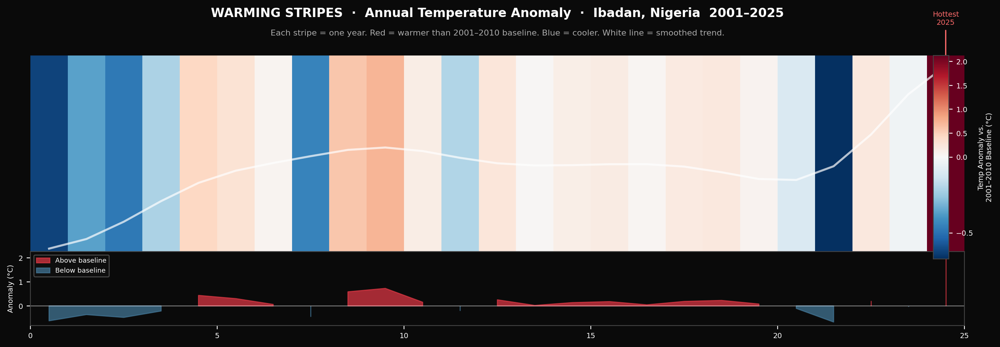
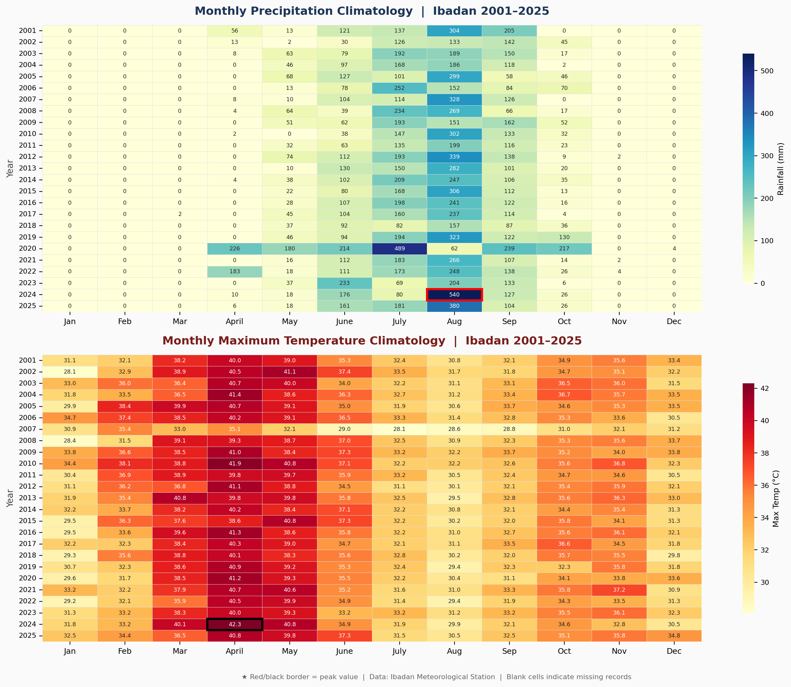
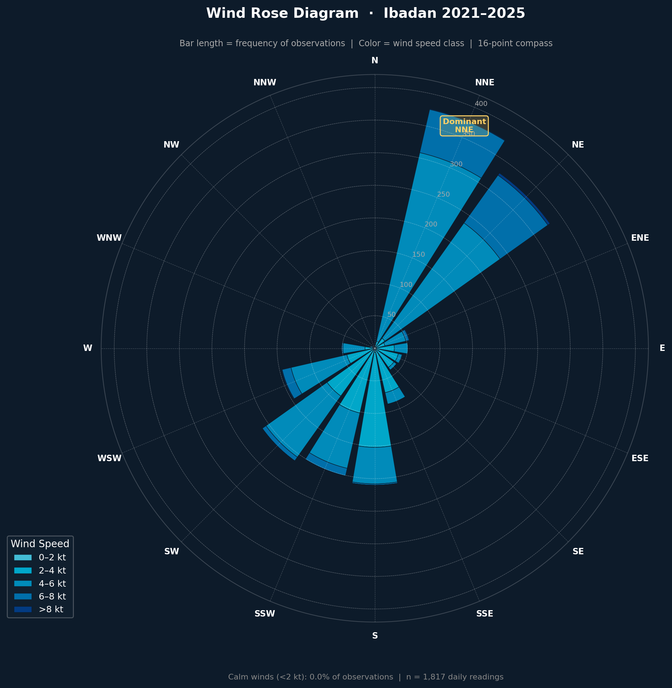
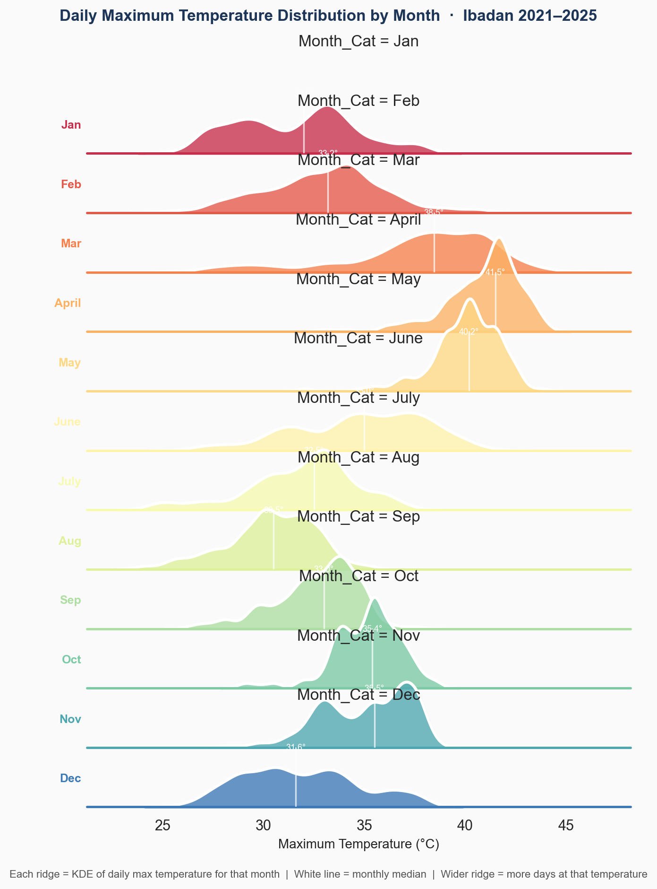
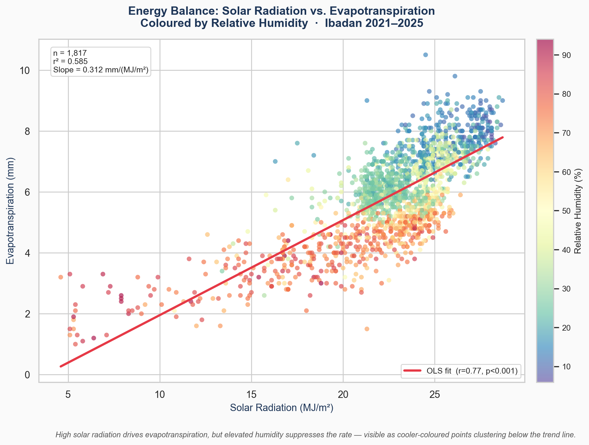
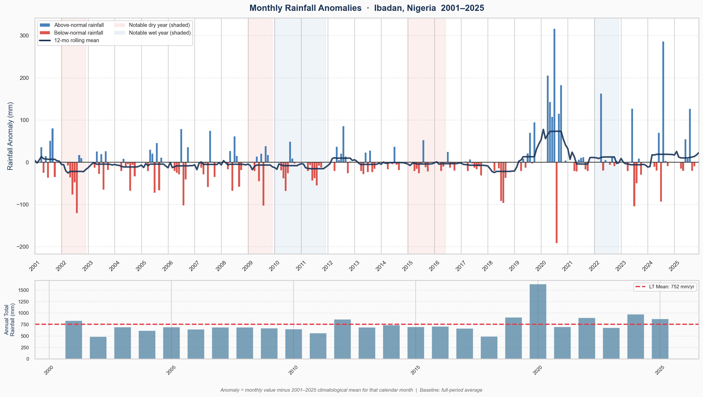
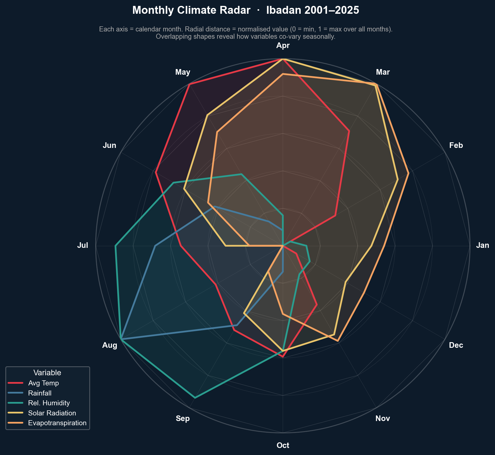
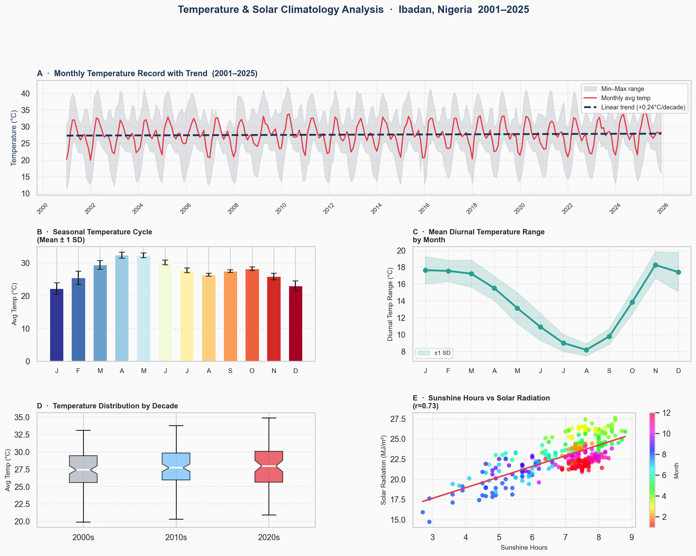

# Climatological Data Analysis & ML Feature Engineering (Potiskum 2001–2025)

## Overview
This repository contains a data engineering and exploratory data analysis (EDA) pipeline for a 25-year meteorological dataset. The project programmatically transforms denormalized, multi-indexed sensor data into a strict tidy format, engineers temporal features for machine learning, and generates publication-quality diagnostics of thermodynamic and seasonal trends.

## Data Processing Pipeline
* **Structural Normalization:** Extracted horizontal data blocks into a `(Date, Variable, Value)` format required for modeling.
* **Anomaly Detection:** Implemented an `IsolationForest` to identify and interpolate hardware logging errors and sensor drift without breaking temporal sequence.
* **Feature Engineering:** Added autoregressive lagged features, rolling standard deviations, and cyclical sine/cosine encoded dates for time-series forecasting.

## Visualizations & Analytical Insights

The following diagnostics were generated to decompose the dataset's structural and thermodynamic properties prior to modeling.

### 1. Warming Stripes: Long-Term Climate Shifts

* **Description:** A chronological timeline of annual average temperatures mapped against a 2001–2010 baseline using a diverging color scale. 
* **Insight:** Isolates the macroscopic warming trend. By plotting deviations from historical norms rather than absolute values, it exposes the accelerating frequency of anomalous heat years over the past decade.

### 2. Dual Heatmaps: Seasonal Anomalies

* **Description:** Matrix plots of monthly precipitation and maximum temperature averages mapped across the 25-year timeline.
* **Insight:** Exposes localized seasonal shifts and extreme weather events. It visually defines the boundaries of the wet/dry seasons and rapidly identifies historical periods of severe drought or unseasonal flooding.

### 3. Wind Rose: Aerodynamic Distribution

* **Description:** A polar histogram plotting the frequency distribution of wind speeds across a 16-point compass.
* **Insight:** Quantifies prevailing atmospheric circulation. It defines the dominant regional wind vectors and the ratio of calm days to high-velocity events, a critical parameter for local infrastructure and agricultural planning.

### 4. Ridgeline Volatility: Temperature Distribution

* **Description:** Stacked Kernel Density Estimation (KDE) plots showing the density distribution of daily maximum temperatures, stratified by month.
* **Insight:** Demonstrates the statistical skewness and variance of heat. Wider ridges indicate months with highly volatile, unpredictable daily maximums, while sharp peaks represent stable meteorological periods.

### 5. Energy Balance Scatter: Thermodynamic Constraints

* **Description:** Multivariate linear regression mapping Solar Radiation against Evapotranspiration, utilizing Relative Humidity as a third-dimensional color gradient.
* **Insight:** Proves the thermodynamic relationship between solar input and water loss. The humidity gradient exposes an environmental constraint: elevated ambient moisture suppresses evapotranspiration rates even during peak solar radiation.

### 6. Rainfall Anomaly Diverging Bars: Hydrological Cycles

* **Description:** A diverging bar chart tracking monthly precipitation deviations from the 25-year historical mean, overlaid with a 12-month rolling average. Notable dry/wet meteorological periods are highlighted via shaded spans, paired with a sub-panel of annual totals.
* **Insight:** Exposes multi-year hydrological cycles by smoothing out seasonal noise. It explicitly identifies sustained shifts in regional precipitation patterns, distinguishing between isolated weather events and prolonged macro-level phenomena like ENSO-driven droughts or wet periods.

### 7. Climate Radar: Multivariate Seasonal Cycles

* **Description:** A normalized polar projection mapping six core meteorological variables simultaneously across the calendar year.
* **Insight:** Defines how variables co-vary seasonally. It identifies the precise overlap where peak rainfall and humidity inversely correlate with drops in solar radiation and temperature.

### 8. Temperature Trend Decomposition: Granular Time-Series

* **Description:** A multi-panel diagnostic dashboard analyzing the linear decadal warming trend, standard seasonal cycles, and diurnal temperature ranges (max vs. min).
* **Insight:** Separates the macro climate-change signal (+°C/decade) from routine intra-day and intra-year volatility, verifying the statistical integrity of the recorded metrics.

## Setup & Reproduction
To execute the pipeline locally:
1. Clone the repository.
2. Install dependencies: `pip install -r requirements.txt` *(pandas, numpy, scikit-learn, matplotlib, seaborn, scipy)*.
3. Run `python src/data_pipeline.py` to generate the ML-ready datasets.
4. Run `python src/visualize.py` to compile the visual diagnostics into the `/assets` directory.